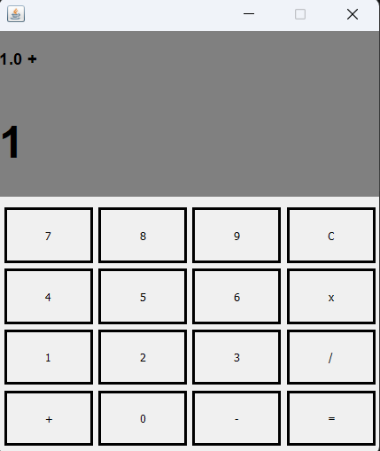

# Java Calculator (AWT & Swing)

## Description
A simple desktop calculator application built using Java AWT and Swing. The application allows users to perform basic arithmetic operations through a graphical user interface (GUI).

---

## Features
- Supports basic operations:
  - Addition (+)
  - Subtraction (-)
  - Multiplication (*)
  - Division (/)
- Clear button (C) to reset the calculator
- Display current input and result
- Simple and clean graphical interface

---

## How It Works
- The interface is built using JFrame, JPanel, JButton, and JLabel
- Each button has an ActionListener to handle user input
- The program stores numbers and operations, then calculates the result when (=) button is pressed

---

## How to Run
### Method 1:
Run the project using: Main.java

### Method 2:
Run the executable file: Calculator.jar

## Screenshot

---

## What I Learned 
- Building a structured desktop application using Java
- Managing user input
- Handling events using ActionListener
